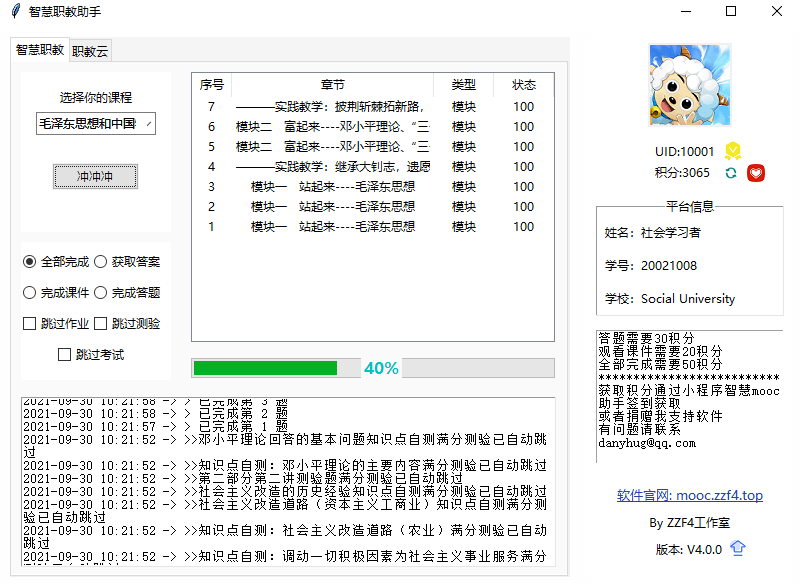

<p align="center">
</br>
<h1>
  
  MoocHelper - 智慧职教助手
</h1> 
使用Python作为开发语言，该版本为第三版
</br>
软件支持智慧职教答题、观看课件，职教云观看课件等功能
</br>
注意：软件适配的是旧版本，新版前往 http://mooc.zzf4.top 下载
</p>


软件界面
----
<div style="text-align: center">

</div>

目录结构
----

```
moocHelper3                         // 软件目录
├─ README.md                     	// 软件介绍
├─ docs								// 软件文档
│    └─ 进度.md
├─ gui								// GUI部分
│    ├─ answerFile					// 获取到的答案文件
│    ├─ connCodeUI.py				// 主文件，第一个GUI文件
│    ├─ dist						// 打包目录，软件在这里打包发布
│    │    ├─ Pack					// 软件包		
│    │    ├─ connCodeUI.exe
│    │    ├─ mainUI.exe
│    │    └─ res					// 软件所需资源
│    ├─ fav.ico						// 软件图标
│    ├─ globalData.py				// 全局数据
│    ├─ log							// 日志目录
│    │    └─ running.log			// 运行中的日志
│    ├─ loginUI.py					// 第二个GUI文件，登录智慧职教平台
│    ├─ mainUI.py					// 主程序，登录后显示
│    ├─ res							// 软件所需资源目录
│    │    ├─ love.png
│    │    ├─ photo.png
│    │    ├─ qr.png
│    │    ├─ refresh.png
│    │    ├─ thanks.png
│    │    ├─ update.png
│    │    ├─ vip1.png
│    │    ├─ vip2.png
│    │    ├─ vip3.png
│    │    └─ vip4.png
│    └─ tool.py						// 工具，里面有一些软件中需要用到的函数
├─ lib								// 软件的功能实现
│    ├─ class						// 各个类
│    │    ├─ file.py				// 文件类，主要负责IO操作
│    │    ├─ mooc.py				// 智慧职教类，负责智慧职教的有关操作
│    │    ├─ user.py				// 用户类，负责平台的登录等操作
│    │    ├─ utils.py				// 工具类，里面写了一个全局请求头，会话状态保持
│    │    ├─ wx.py					// 微信类，主要是与小程序相关的操作
│    │    └─ zjy.py					// 职教云类，负责职教云的有关操作
│    ├─ running.log					// 运行时的日志
├─ start.py							// 无实际意义
└─ 新建文本文档.txt					// 使用Pyinstaller时的打包命令
```

软件原理
----

- 获取答案
  - 智慧职教在答完问题后，就可以查看已完成题目的正确答案。
  - 在选择获取答案功能后，软件会遍历所有的测验作业以及考试，然后依次提交，这时的成绩为0分，但是已经可以查看答案了。软件会在提交后查看答案，并且以Base64的方式将答案保存至answerFile文件夹中。
- 答题功能
  - 软件会遍历answerFile文件夹中的内容，使用Base64将文件夹的答案解码，然后依次发送数据，完成答题。
- 观看课件
  - 软件会直接向智慧职教/职教云的对应接口发送数据，数据内容为若干ID和对应的课件时长

如何使用
----

- 安装依赖 `pip install -r requirements.txt`
- 运行gui/loginUI.py文件

License
----
This is free software, and you are welcome to redistribute it under certain conditions.

MoocHelper is licenced under [](https://www.gnu.org/licenses/gpl-3.0)

```
    MoocHelper, A software that helps students complete online class tasks.
    Written in Python. Open source now

    This program is free software: you can redistribute it and/or modify
    it under the terms of the GNU General Public License as published by
    the Free Software Foundation, either version 3 of the License, or
    (at your option) any later version.

    This program is distributed in the hope that it will be useful,
    but WITHOUT ANY WARRANTY; without even the implied warranty of
    MERCHANTABILITY or FITNESS FOR A PARTICULAR PURPOSE.  See the
    GNU General Public License for more details.

    You should have received a copy of the GNU General Public License
    along with this program.  If not, see <https://www.gnu.org/licenses/>.
```
